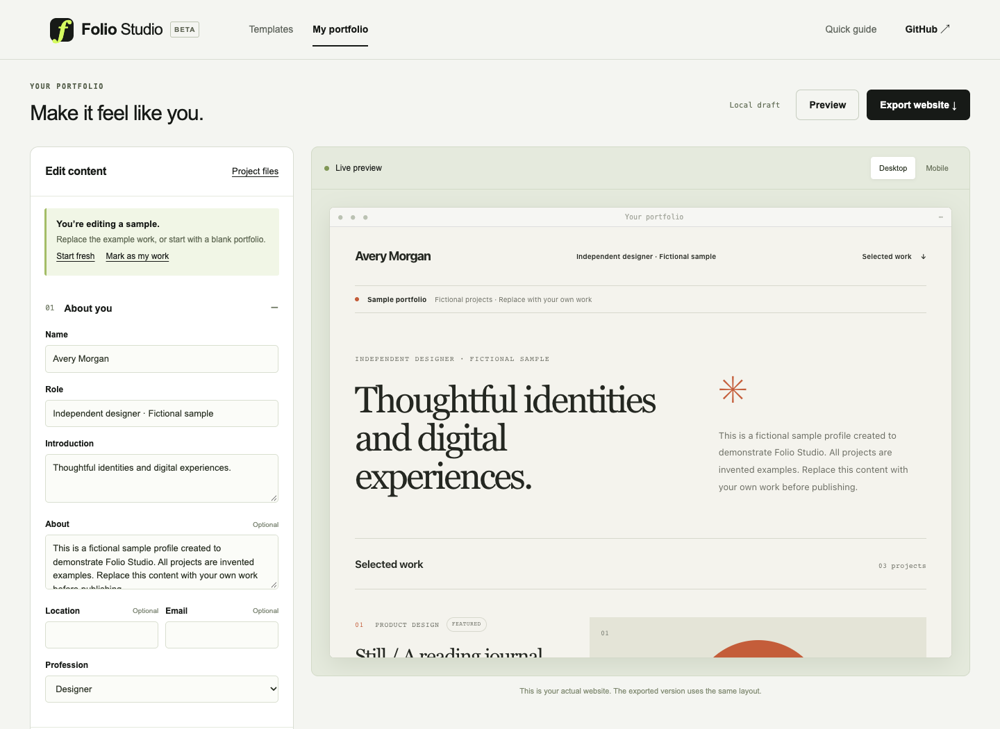
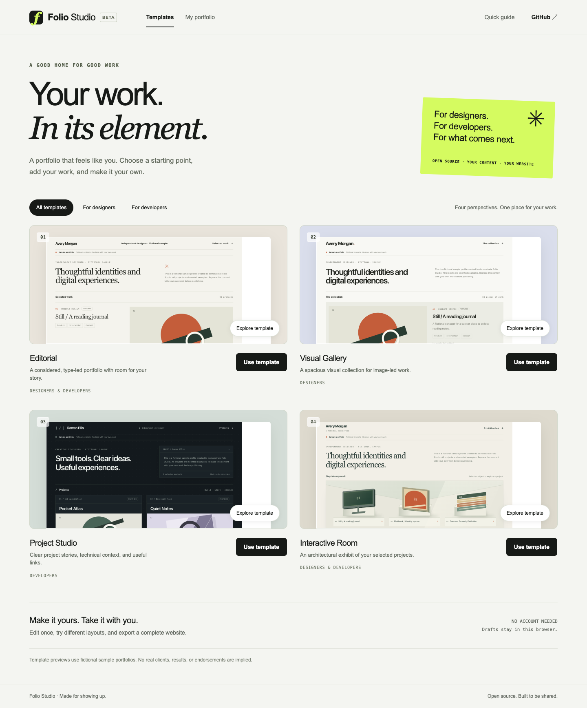
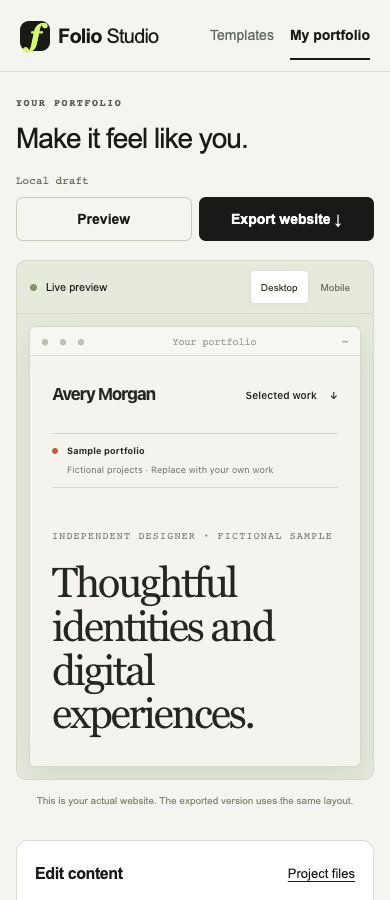

# Folio Studio

**让你的作品，以你的方式呈现。** 面向设计师、开发者和独立创作者的开源作品集编辑器。选择视觉模板，补充项目故事，导出一份自己能够保存和发布的网站。

**当前状态：** 0.1.0 发布候选版。公开 GitHub 分发和线上编辑器演示尚未发布，可按下方说明运行本地源码。

[English](README.md) · [演示流程](docs/DEMO.md) · [贡献指南](CONTRIBUTING.md) · [模板制作规范](docs/template-authoring.md) · [实际测试报告](docs/TEST_REPORT.md)



**动效分支：** `feature/template-motion`。四套模板的动效与录屏见[动效指南](docs/MOTION.md)，尚未合并到线上编辑器。

## 四个模板，同一份内容

| 模板                 | 适合用途             | 呈现方式                                    |
| -------------------- | -------------------- | ------------------------------------------- |
| **Editorial**        | 个人介绍与完整案例   | 排版清晰、留白充足，以阅读为主              |
| **Visual Gallery**   | 设计与视觉作品       | 以图片呈现作品，并保留项目故事              |
| **Project Studio**   | 软件、工具和独立项目 | 紧凑的项目总览、体验与源码链接              |
| **Interactive Room** | 有个性的个人展示     | 由 CSS 构建建筑式展厅，项目入口可用键盘访问 |



0.1 的整个产品界面为**英语**。支持个人资料、最多 12 个项目、案例的挑战/解决方案/结果、图片上传、项目排序、强调色、动画偏好、响应式预览及单文件网站导出。样例人物和项目均为虚构并明确标注；抽象装饰图不是实际项目截图。

## 使用流程

1. 点击 **Use template**，进入 **Edit content**。
2. 用自己的姓名、角色、介绍、图片和链接替换样例，按需补充项目案例。
3. 切换模板或强调色，内容会保留。
4. 用 **Preview** 检查网站、窄屏效果和项目链接。
5. 用 **Download project** 下载可继续编辑的 JSON 备份；以后使用 **Import project** 打开。
6. 用 **Export website** 下载独立的 `index.html`，本地打开或上传到静态网站托管服务。

如果保存的草稿无法打开，编辑器会保留原文。先通过 **Project files → Download previous draft** 下载原文件，再明确确认 **Start fresh** 或导入替换。

**Local draft** 表示草稿保存在当前浏览器、当前网站来源的存储中，并非云端备份。清理浏览器数据、更换设备或网址、覆盖草稿前，请下载项目备份。**Start fresh** 会替换当前草稿；0.1 没有服务器回收站或账号历史。

邮箱和项目链接写到一半时，也能保存在本地草稿和 JSON 备份中继续编辑。这些原文仅作为可编辑文字保存：预览不会生成无效链接，网站导出仍要求联系方式和链接有效。JSON 导入会校验结构、字段类型与长度、图片格式、项目数量和文件大小，并在确认后替换当前草稿。

上传的 PNG、JPEG、WebP 图片会在本机优化，再嵌入 JSON 备份和导出的 HTML。优化前上传文件最多 8 MiB，保存后单图最多 2 MiB，JSON 备份的 UTF-8 字节数不能超过 8 MiB；浏览器存储可能更早达到容量限制。大图片会增大文件体积，建议提前压缩。生成的网站不依赖远程字体或素材 CDN。



## 可选的 GitHub 导入

**Import from GitHub** 从 GitHub REST API 读取公开资料和公开仓库。无需登录、OAuth 授权、密码或个人访问令牌。导入后请确认描述和链接：仓库的 homepage 只是作者填写的链接，不代表已部署或可正常体验；GitHub 元数据也不能自动提供案例和真实截图。

导入器按每页最多 100 个读取个人拥有的仓库，最多 10 页，达到边界时会提示截断；作品集最多保留 12 个项目。账号不存在、没有公开仓库、网络失败和请求受限会显示明确状态，不以编造的数据替代。

匿名请求通常按来源 IP 限制为**每小时 60 次**；同一网络的其他用户可能共享额度。GitHub 还设有二级限制。查询个人资料和每一页仓库都各消耗一次请求。详见官方[限额文档](https://docs.github.com/en/rest/using-the-rest-api/rate-limits-for-the-rest-api)、[公开仓库接口](https://docs.github.com/en/rest/repos/repos#list-repositories-for-a-user)和[分页说明](https://docs.github.com/en/rest/using-the-rest-api/using-pagination-in-the-rest-api)。

导入结果是一份快照，不验证账号所有权、不读取私有仓库、不持续同步，也不会在仓库转为私有后自动撤回已导出的网站。你决定哪些内容出现在导出文件中，并负责更新或移除已托管的网站副本。

## 本地运行

需要 **Node.js 22 或更新版本**和 npm。

在源码项目目录中执行：

```sh
npm ci
npm run dev
```

打开 [http://127.0.0.1:4173](http://127.0.0.1:4173)。无需服务账号、数据库、`.env` 或付费 API。浏览器运行不依赖 npm 运行时包；Playwright 用于开发时浏览器检查，Prettier 用于源码和文档格式化。

```sh
npm test
npm run build
npx playwright install chromium
npm run test:e2e
```

构建结果在 `dist/`。浏览器测试需要 Chromium；Linux CI 使用 `npx playwright install --with-deps chromium`。实际执行范围和结果见[测试报告](docs/TEST_REPORT.md)，工作流文件的存在不等于线上部署或真实 API 测试已通过。

## 部署编辑器

Folio Studio 是静态浏览器应用，可将 `dist/` 内容放在任何 HTTP/HTTPS 静态服务器。不要通过 `file:` 直接打开编辑器的 ES module 源码。

源码提供 [GitHub Pages 工作流](.github/workflows/pages.yml)，可将自己的源码副本放到 GitHub 后部署：

1. 保留 `main` 分支，启用 GitHub Actions。
2. 在 **Settings → Pages → Build and deployment** 中将 Source 设为 **GitHub Actions**。
3. 推送到 `main`，或在 Actions 中手动执行 **Deploy GitHub Pages**。
4. 检查部署结果，打开 `github-pages` 环境给出的地址。

工作流会测试、构建、上传 `dist/`，通过 GitHub 官方 Pages Actions 部署；只有部署任务拥有 `pages: write` 和 `id-token: write`。仓库设置与账号要求见[官方说明](https://docs.github.com/en/pages/getting-started-with-github-pages/using-custom-workflows-with-github-pages)。

## 发布你的个人网站

导出的 `index.html` 已包含样式和上传图片。上传到能够提供静态 HTML 的服务，例如独立的 GitHub Pages 仓库即可。托管账号和域名由你选择；Folio Studio 不代为发布，也无需与个人作品网站部署在一起。

这个过程只分享导出的文档，不上传浏览器中的其他草稿。公开前检查联系方式、图片、案例和外部链接。删除托管副本无法删除他人已经下载的文件或第三方缓存。

## 数据和许可

编辑与预览使用浏览器本地存储；浏览器容量和隐私设置可能限制保存，清理存储会删除本地草稿。存储不可用或已满时，编辑器会提示未保存，并引导下载项目备份。只有主动使用 GitHub 导入时会向 `api.github.com` 查询。0.1 没有 Folio Studio 云账号、云保存、分析追踪、AI 请求或服务器发布。

代码、文档、虚构样例与原创 CSS 装饰的版权属于 2026 Folio Studio contributors，适用 [Apache-2.0](LICENSE)，素材来源见 [ASSETS.md](docs/ASSETS.md)。你上传的图片、文字、导入的仓库内容及作品集内容保留各自的版权与许可；使用工具不会将这些内容重新授权给项目，也不会自动变为 Apache-2.0。导出文件中的模板代码保留原有许可。

欢迎贡献模板、可访问性和移动端修复、可复现的问题报告与编辑体验改进。参见 [CONTRIBUTING.md](CONTRIBUTING.md)、[模板规范](docs/template-authoring.md)和 [SECURITY.md](SECURITY.md)。0.1 的模板以经过审核的源码贡献加入，不含可执行第三方插件市场。
