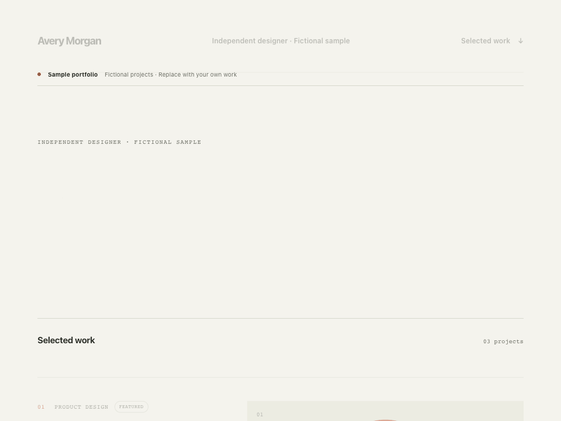
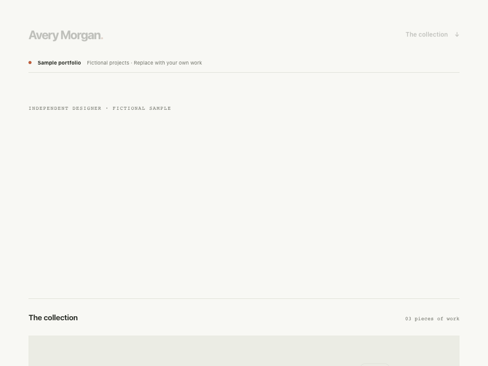
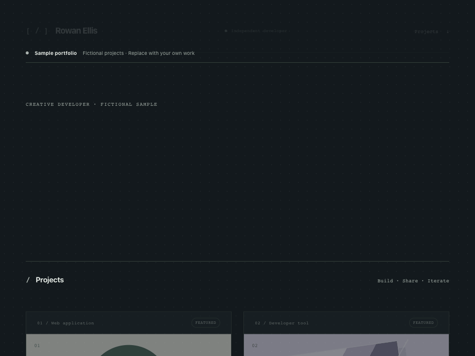
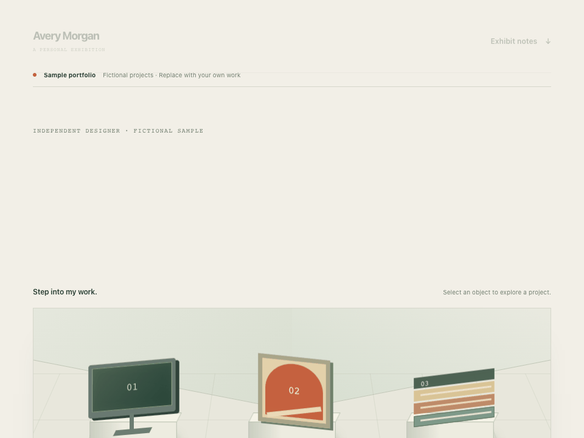

# Portfolio motion

The `feature/template-motion` branch adds original motion to all four templates. The public Pages editor continues to follow `main` until this branch is merged.

| Template         | Entrance                                     | Scroll                                  | Interaction                                                                     |
| ---------------- | -------------------------------------------- | --------------------------------------- | ------------------------------------------------------------------------------- |
| Editorial        | Masked word reveal, staggered introduction   | Project chapters arrive with the reader | Artwork gently enlarges; the editorial mark turns; links draw an underline      |
| Visual Gallery   | Slower word choreography, artwork unfolds    | Images drift inside their frames        | Artwork layers separate and turn slightly                                       |
| Project Studio   | Quick typography, perspective panel assembly | Project panels arrive independently     | A light sweep crosses the art; the card edge lights up                          |
| Interactive Room | Typography, skylight and staggered objects   | Exhibits rise as the stage enters view  | Objects lift from their plinths, shadows recede, arrows lead into project notes |

In **Explore template** or the editor, use **Replay motion** to watch the entrance again. **Look & feel → Portfolio motion** switches motion off for that portfolio; this preference is preserved in drafts, backups and exports. The visitor's system reduced-motion preference takes priority. Replaying never changes creator content or overrides these preferences.

## Demonstrations

These recordings are captured from real exports with fictional sample content, not conceptual videos. Download the [Editorial](demos/editorial.html), [Visual Gallery](demos/gallery.html), [Project Studio](demos/studio.html), or [Interactive Room](demos/room.html) HTML and open it locally to experience the full interaction. GitHub displays the source of HTML files rather than running them.

## Implementation and fallback

Motion uses local CSS keyframes, individual transforms, native view timelines and standard anchors/details. There is no new runtime dependency, canvas, remote asset, tracking, scroll interception or template script. The same stylesheet runs in script-disabled preview iframes and self-contained exports. Timed entrances finish within two seconds; there are no perpetual decorative loops.

Scroll effects are guarded by `@supports (animation-timeline: view())`. Browsers without that feature retain timed entrances and interaction transitions. They display every project normally. Compact catalog thumbnails use timed entrances rather than scroll choreography, so a small thumbnail never conceals a project behind a scroll trigger. Keyboard-focused cards and targeted project records bypass arrival effects. Hover decoration is reserved for fine pointers; touch visitors use ordinary links and case-study controls.

The title has one accessible text label and an `aria-hidden` visual word layer. Words remain selectable and wrap at narrow widths, including unusually long words. System reduced motion, the creator's switch and printing disable animation; no reveal requires JavaScript to make content readable.

## References and original work

- [Framer Academy: scroll transforms](https://www.framer.com/academy/lessons/framer-animations-scroll-transform) — reference for layering image movement with scroll and checking responsive behavior.
- [Motion: accessible animation](https://motion.dev/docs/react-accessibility) — reference for respecting system preferences. Motion is not a dependency of this project.
- [Lusion](https://lusion.co/) — reference for spatial storytelling and interactive exhibition presentation. No code, models or images from Lusion are used.
- [MDN: animation-timeline](https://developer.mozilla.org/en-US/docs/Web/CSS/Reference/Properties/animation-timeline) — native CSS API and browser support information.

All motion code, artwork and recordings are original Folio Studio work under the repository's Apache-2.0 license. Creator content retains its own rights. See [the asset inventory](ASSETS.md) and [motion verification](MOTION_TEST_REPORT.md) for provenance and actual test coverage.
